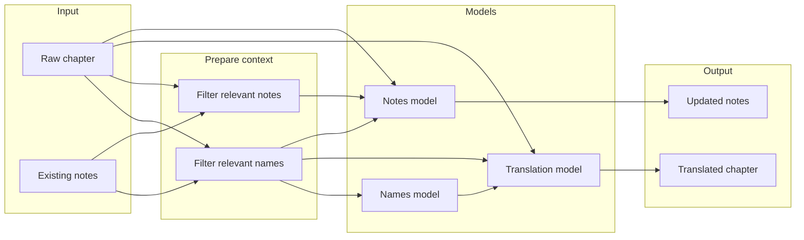

# Translator Harness

## Workflow

```mermaid
flowchart LR
    subgraph INPUT["Input"]
        RC["Raw chapter"]
        RN["Existing notes"]
    end

    subgraph PREP["Prepare context"]
        FN["Filter relevant names"]
        FN2["Filter relevant notes"]
    end

    subgraph MODELS["Models"]
        NM["Names model"]
        TM["Translation model"]
        NDM["Notes model"]
    end

    subgraph OUTPUT["Output"]
        TC["Translated chapter"]
        WN["Updated notes"]
    end

    RC --> FN
    RN --> FN

    RC --> FN2
    RN --> FN2

    FN --> NM

    RC --> TM
    FN --> TM
    NM --> TM
    TM --> TC

    RC --> NDM
    FN --> NDM
    FN2 --> NDM
    NDM --> WN
```

