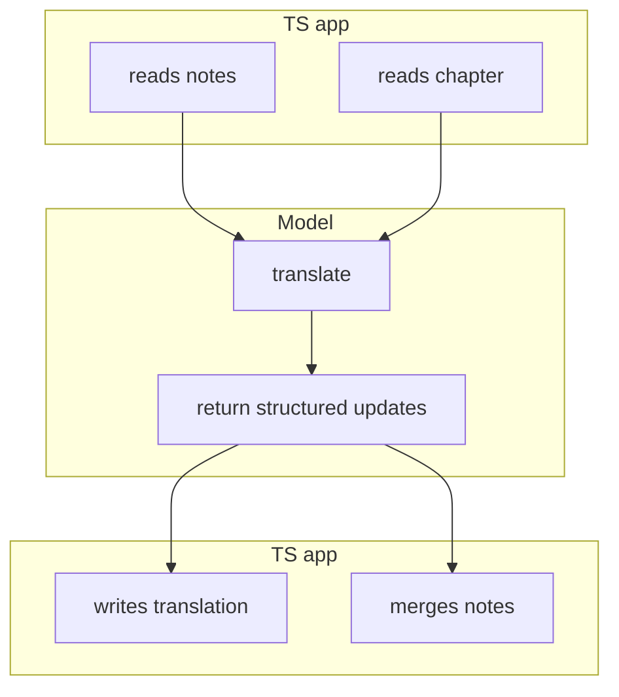

# Translator Harness

## Introduction

```mermaid
flowchart TD
    subgraph APP1["TS app"]
        N["reads notes"]
        C["reads chapter"]
    end

    subgraph MODEL["Model"]
        T["translate"]
        U["return structured updates"]
    end

    subgraph APP2["TS app"]
        W["writes translation"]
        M["merges notes"]
    end

    N --> T
    C --> T
    T --> U
    U --> W
    U --> M
```

