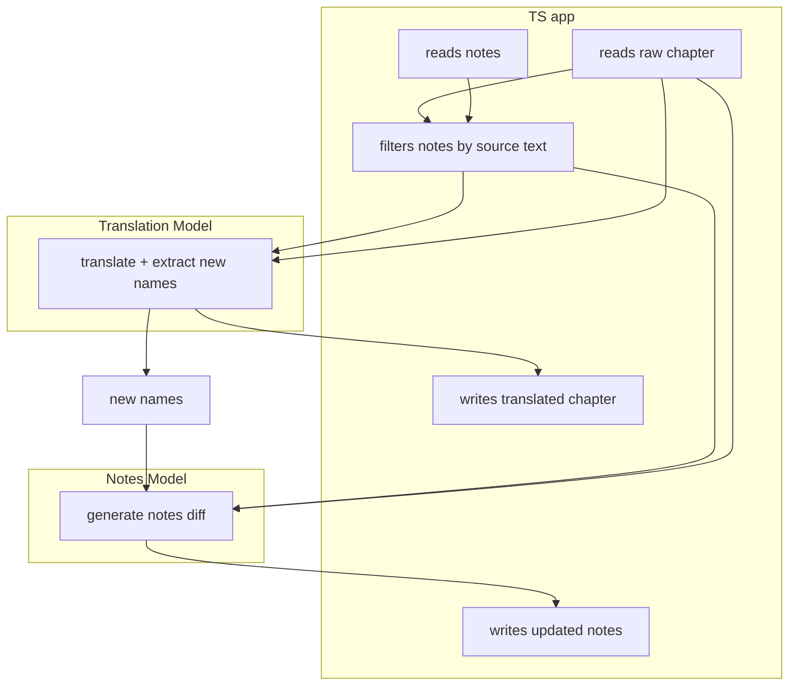

# Translator Harness

## Introduction

```mermaid
flowchart TD
    subgraph APP["TS app"]
        RC["reads raw chapter"]
        RN["reads notes"]
        FN["filters notes by source text"]
        TC["writes translated chapter"]
        WN["writes updated notes"]
    end

    subgraph MODEL1["Translation Model"]
        TM["translate + extract new names"]
    end

    subgraph MODEL2["Notes Model"]
        NM["generate notes diff"]
    end

    RC --> FN
    RN --> FN
    FN --> TM
    RC --> TM
    TM --> TC
    TM --> NN["new names"]
    NN --> NM
    FN --> NM
    RC --> NM
    NM --> WN
```

